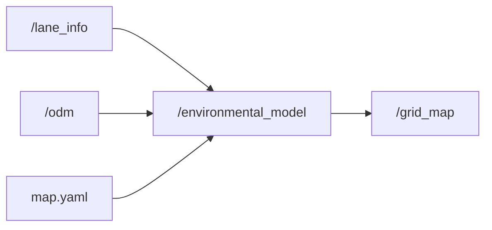

# Environmental Model
ROS2 Environmental Model package for Autonomous Vehicle Navigation.

## Main Contributor
[Lindsay Shantha Rubia](https://git.hs-coburg.de/lin9417s)

## Overview
The **Environmental Model** in autonomous vehicles integrates data from various sensors to create a comprehensive representation of the surrounding environment. This includes information from sensors like **LIDAR**, **RADAR**, **Cameras**, and **GPS**. It acts as a crucial input to higher-level planning modules, such as the **Global Planner**, to ensure safe and optimal navigation for self-driving vehicles.

## Table of Contents
- [Architecture Diagram](#architecture-diagram)
- [Nodes](#nodes)
- [Installation](#installation)
- [Usage](#usage)
- [Testing](#testing)
- [License](#license)

## Architecture Diagram


## Nodes

### Node: `environment_model`

This node integrates data from various sensors and static maps to generate an occupancy grid that represents the surrounding environment, which is then published on the `/grid_map` topic.

#### Topics

| **Topic Name**                | **Input/Output** | **Type**                 | **Description**                                                       |
|-------------------------------|------------------|--------------------------|-----------------------------------------------------------------------|
| `/lane_info`                   | Input            | `std_msgs/String`        | Lane structure and road information to help in path planning.         |
| `/odm`                         | Input            | `std_msgs/String`        | Object detection map data, including both static and dynamic obstacles.|
| `/map.yaml`                    | Input            | `custom_msgs/ModelCity`  | Static map data representing the model city.                         |
| `/grid_map`                    | Output           | `nav_msgs/OccupancyGrid` | Occupancy grid data for the environment, used by the Global Planner.  |

#### Parameters (Runtime-Adjustable)

| **Parameter Name**      | **Type**   | **Default Value** | **Description**                                                        |
|-------------------------|------------|-------------------|------------------------------------------------------------------------|
| `planning_horizon`      | `float64`  | `10.0`            | Time horizon for global path planning in seconds.                      |
| `lane_change_safety_gap`| `float64`  | `3.0`             | Minimum safety gap for executing a lane change.                        |
| `stop_threshold`        | `float64`  | `0.5`             | Minimum distance threshold to initiate a stop action.                  |

## Installation

1. Clone the repository:
```bash
git clone https://git.hs-coburg.de/TEAM_BLAZE/environment_model.git
```

2. Build the package:
```bash
colcon build --packages-select environmental_model
```

3. Source the workspace:
```bash
source install/setup.bash
```

## Usage

### Launching the Nodes
To launch the **Environmental Model** node and start publishing grid maps, run the following command:
```bash
ros2 launch environmental_model environmental_model.launch.py
```

## Testing

### Unit Tests
To run the unit tests for this package, use the following command:

```bash
colcon test --packages-select environmental_model
```

## License

This project is licensed under the **Apache 2.0 License** - see the [LICENSE](LICENSE) file for details.
```

